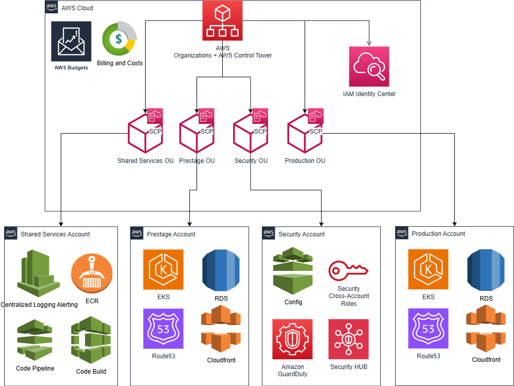

# Innovate Inc. - Architecture Design





## 1. Cloud Environment Structure
### Recommended AWS Account Strategy: Multi-Account Setup
**Proposed Accounts:**
1. **Management Account** - AWS Organizations root account
2. **Staging Account** - Development, pre-production testing and validation
3. **Production Account** - Live application environment
4. **Security Account** - Centralized security services, AWS config for compliance, cross-account roles, logging
5. **Shared Services Account** - Common resources such as ECR, CI/CD flow, etc

### Justification:
- **Isolation**: Clear boundaries between environments prevent accidental changes but with full CI/CD advantages.
- **Security**: Blast radius containment and granular access control. IAM identity provider of your choosing recommended with cross-account roles for secure access between accounts.
- **Billing**: Transparent cost allocation per environment, with sharable reservations and enforced cost allocation tagging.
- **Management**: AWS Organizations provides centralized governance, also used for consolidated billing, management and SCP guardrails implementation.

## 2. Network Design
### VPC Architecture
**Multi-AZ VPC Design (per account): EKS Cluster**

```
Production VPC (10.0.0.0/16)
├── Public Subnets (DMZ)
│   ├── us-east-1a: 10.0.1.0/24 (Application Load Balancer + NAT + IGW)
│   ├── us-east-1b: 10.0.2.0/24 (Application Load Balancer)
├── Private Subnets (Application Tier)
    ├── us-east-1a: 10.0.11.0/24 (EKS Nodes)
    ├── us-east-1b: 10.0.12.0/24 (EKS Nodes)
    └── us-east-1c: 10.0.13.0/24 (EKS Nodes)
```
**Multi-AZ VPC Design (per account): RDS**

```
Production VPC (10.1.0.0/24)
├── Private Subnets (Application Tier)
    ├── us-east-1a: 10.1.0.0/28 (EKS Nodes)
    ├── us-east-1b: 10.1.0.16/28 (EKS Nodes)
    └── us-east-1c: 10.1.0.32/28 (EKS Nodes)
```
Separate VPCs for RDS and EKS for better isolation between components, as well as for decoupling between stateful and stateless services. ***VPC PEERING*** will be required for the connectivity betweeen the EKS cluster and RDS.

### Network Security Implementation
**1. Network Segmentation:**
- Public subnets: Load balancers, NAT and Internet Gateways only
- Private subnets: Application workloads with no direct internet access
- Database VPC: Isolated database layer with custom route tables and security group rules allowing access only from EKS security group

**2. Security Groups (Stateful Firewall Rules):**
```
ALB Security Group:
- Inbound: Port 443 (HTTPS) from 0.0.0.0/0
- Inbound: Port 80 (HTTP) from 0.0.0.0/0 (redirect to HTTPS)
- Outbound: Port 30000-32767 to EKS Security Group

EKS Node Security Group:
- Inbound: Port 30000-32767 from ALB Security Group
- Inbound: All traffic from same security group (cluster communication)
- Outbound: Port 443 to 0.0.0.0/0 (HTTPS)
- Outbound: Port 5432 to Database Security Group

Database Security Group:
- Inbound: Port 5432 from EKS Node Security Group only
```

**3. Additional Security Measures:**
- AWS WAF on Application Load Balancer
- VPC Flow Logs for network monitoring
- NAT Gateway for secure outbound internet access

## 3. Compute Platform - Amazon EKS
### EKS Cluster Design
1 Cluster per environment with all spot instances in prestage and on-demand instances in production.

**Cluster Configuration:**
- **Service**: Amazon EKS (Elastic Kubernetes Service)
- **Version**: Latest stable Kubernetes version
- **Control Plane**: Managed by AWS across multiple AZs
- **Networking**: VPC CNI for pod networking
- **Authentication**: IAM integration with RBAC

### Node Groups Strategy
#### Production
**1. Default Node Group (kube-system):**
```yaml
Instance Type: t3a.small (2 vCPU, 2GB RAM)
Min Size: 1 nodes
Scaling: Cluster Autoscaler enabled
Subnet: Private subnets across all AZs
```

**2. Workload Node Group (on-demand):**
```yaml
Instance Type: m5a.large (2 vCPU, 8GB RAM)
Min Size: 2 nodes
Scaling: Cluster Autoscaler enabled
Subnet: Private subnets across all AZs
```
#### Prestage
```yaml
Instance Type: t3a.small (2 vCPU, 2GB RAM)
Min Size: 1 nodes
Scaling: Cluster Autoscaler enabled
Subnet: Private subnets across all AZs
```

**2. Workload Node Group (spot):**
```yaml
Instance Type: m5a.large (2 vCPU, 8GB RAM)
Min Size: 0 nodes
Scaling: Cluster Autoscaler enabled
Subnet: Private subnets across all AZs
```

### EKS Add-ons and Components
**Core Add-ons:**
- **VPC CNI**: Pod networking
- **CoreDNS**: DNS resolution
- **kube-proxy**: Network proxy
- **EBS CSI Driver**: Persistent storage
- **AWS Load Balancer Controller**: ALB integration

**Additional Tools:**
- **Cluster Autoscaler**: Automatic node scaling
- **Metrics Server**: Resource utilization metrics
- **AWS Node Termination Handler**: Graceful spot instance handling (required for prestage environment)
- **CSI Secrets Store**: For retrieving secrets from AWS Secrets Manager

### Containerization Strategy
**1. Container Registry:**
- **Service**: Amazon ECR (Elastic Container Registry)
- **Security**: Image vulnerability scanning enabled
- **Lifecycle**: Automated cleanup of old images

**2. Deployment Process:**
- Automated using CodeDeploy and Kustomize overlays for both prestage and production environments, enforcing GitOps approach.
- Strategy: All at once for prestage - faster deployment, rolling or blue green for critical services with end user impact in production

## 4. Database Architecture
### Recommended Database Services:
#### RDS for PostgreSQL in prestage
Deployed in an isolated VPC, with 3 private subnets spanning 3 availability zones for better security and decoupling purposes.

**Service Choice Justification:**
- **Managed Service**: Automated backups, patching, and maintenance
- **Security**: Encryption at rest and in transit
- **Monitoring**: CloudWatch integration and Performance Insights

#### Aurora for PostgreSQL in production
**Service Choice Justification:**
- **High Availability**: Multi-AZ deployment for failover
- **Performance**: Read replicas for scaling read operations
- **Managed Service**: Automated backups, patching, and maintenance
- **Security**: Encryption at rest and in transit
- **Monitoring**: CloudWatch integration and Performance Insights
- **Highly scalable** with no end-user impact

### Backup and Disaster Recovery Strategy
**1. Automated Backups:**
- **Retention Period**: 30 days
- **Backup Window**: During low-traffic hours (2-4 AM UTC)
- **Point-in-Time Recovery**: Enabled (up to 5 minutes)
- **Cross-Region Backups**: Enabled for disaster recovery

**2. Manual Snapshots:** Available but not recommended. Should leverage only PiT restore and the automated backups available for the RDS.

**3. Disaster Recovery:**
- **RTO (Recovery Time Objective)**: < 1 hour
- **RPO (Recovery Point Objective)**: < 5 minutes
- **Cross-Region Read Replica**: For geographic disaster recovery (can be promoted to a master)
- **Automated Failover**: Multi-AZ configuration provides automatic failover

### Database Security Measures
**1. Network Security:**
- Private subnets only (no internet access)
- Security groups restricting access to EKS nodes only
- Database subnets group spanning multiple AZs

**2. Access Control:**
- IAM database authentication for applications
- Separate database users for different environments
- Connection pooling via PgBouncer for connection management
- Secrets Manager and Parameter store for handling sensitive data

**3. Encryption:**
- Encryption at rest using AWS KMS
- Encryption in transit via SSL/TLS
- Separate KMS keys for different environments

## 5. CI/CD Pipeline Architecture
### Recommended Services:
- **Source Control**: GitHub/GitLab integration
- **Build Service**: AWS CodeBuild
- **Pipeline**: AWS CodePipeline
- **Deployment**: AWS CodeDeploy + Kubectl + Kustomize

### Pipeline Stages:
1. **Source**: Code commit triggers pipeline
2. **Test**: Unit tests and security scans
3. **Build**: Container image creation and push to ECR
5. **Deploy to Prestage**: Automatic deployment after build and push completes
6. **Deploy to Production**: Manual approval required

## 7. Monitoring and Observability
### Monitoring Stack

**1. Metrics:**
- **Prometheus**: Kubernetes and application metrics
- **Grafana**: Visualization and dashboards (deployed in EKS)

**2. Logging:**
- **Loki**: Centralized log aggregation reusing Grafana for vizualization
- **Application logs**: Structured JSON logging